# Sentiment Analysis Problem Background Overview

The goal is to create a model that can identify the sentiment of a given query. This can be useful for understanding customer opinions about a product or situation. The model should output the sentiment and confidence score.

In this presentation, I will walk you through my methodology, give a brief overview of the code, show a demo of the working model, present the test cases output with metrics such as accuracy, and suggest possible future improvements

## Methodology 

1. **`Define the problem`**: Our test cases come from the Sentiment140 dataset, which is a multiclass dataset. We will use a hybrid lexicon approach to analyze the data {positive, neutral, negative}.

    * `sentiment analysis` is an important KPI for many enterprises.
    * `sentiment_test_cases.csv`: a modified version of the Sentiment140 - Test dataset containing 489 test cases
        * lexical-based unsupervised learning problem: multi-class (positive, negative, and neutral)
        * balanced dataset: instances of each class are relatively close to each other
        * 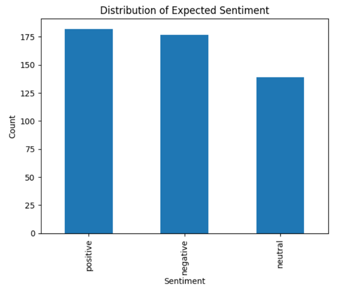

    * `sentiment140`: commonly used as a benchmark dataset for evaluating sentiment analysis methods.
        *  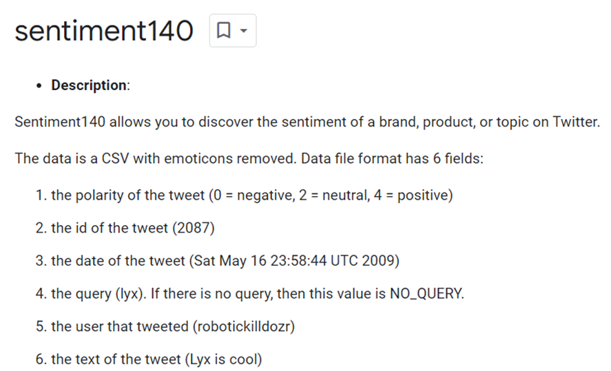
    *

2. **`Model selection`**: We will benchmark related open-source models based on their size, parameters, training dataset, training date, popularity, etc.

| Model | Base Model | Description | Latest Update | Downloads last month | Language | Fine-tuned Dataset | Model Size | Parameters | Labels |
| --- | --- | --- | --- | --- | --- | --- | --- | --- | --- |
| cardiffnlp/twitter-roberta-base-sentiment-latest | RoBERTa-base | RoBERTa-base model trained on Twitter 2021 ~124M (RoBERTa-base) fine-tuned on TweetEval benchmark (~124M tweets) | 2022 | 1,618,710 | English | tweet_eval ~66k tweets (train=45.6k,test=12.3k,val=2k) | 500MB | 125M | Negative, Neutral, Positive |
| cardiffnlp/twitter-xlm-roberta-base-sentiment | XLM-RoBERTa-base | Multilingual XLM-RoBERTa-base model trained on ~198M tweets and fine-tuned for sentiment analysis | 2021 | 1,179,935 | Multilingual | 8 languages (Ar, En, Fr, De, Hi, It, Sp, Pt) tweets | 1.3GB | 270M | Negative, Neutral, Positive |
| cardiffnlp/twitter-roberta-base-sentiment | RoBERTa-base | RoBERTa-base model trained on Twitter ~58M (RoBERTa-base) fine-tuned on TweetEval benchmark (~58M tweets) | 2021 | 771,567 | English | tweet_eval ~66k tweets	| 500MB	| 125M	| LABEL_0, LABEL_1, LABEL_2 |
| finiteautomata/bertweet-base-sentiment-analysis	| BERTweet-base	| VinAIResearch/BERTweet model trained on Twitter 2012-2019 845M English Tweets and 5M COVID-19 Tweets	| 2023	| 230,948	| English	| SemEval 2017 corpus (around ~40k tweets)	| 530MB	| 135M	| NEG, NEU, POS |

    * To have access on each of the model, you can clone from below repositories:
        * `git clone https://huggingface.co/cardiffnlp/twitter-roberta-base-sentiment-latest`
        * `git clone https://huggingface.co/cardiffnlp/twitter-xlm-roberta-base-sentiment`
        * `git clone https://huggingface.co/finiteautomata/bertweet-base-sentiment-analysis`
        * `git clone https://huggingface.co/cardiffnlp/twitter-roberta-base-sentiment`

3. *`*Development`**: 

    * **App Work Flow**:
    *
        * 

    * **Sampled Testing via Inference API**:
        * Objective: Easily load any model from HuggingFace INFERENCE and test the model output and confidence score of a given model from a given text.
        * `Input`: text
        * `Output`: model output {sentiment, confidence_score}
            * [GitHub Repository](<URL>)
            1. `RUN LOCAL SCRIPT`: i.e model_name = `cardiffnlp/twitter-xlm-roberta-base-sentiment`

            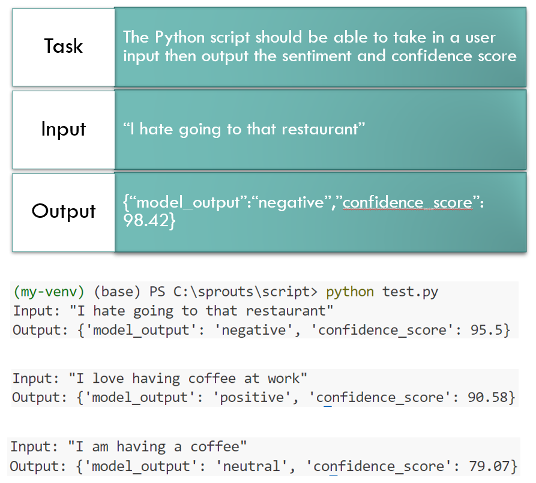

            2. `RUN ON CLOUD WEB APPLICATION`: model_name = `cardiffnlp/twitter-xlm-roberta-base-sentiment-latest`

            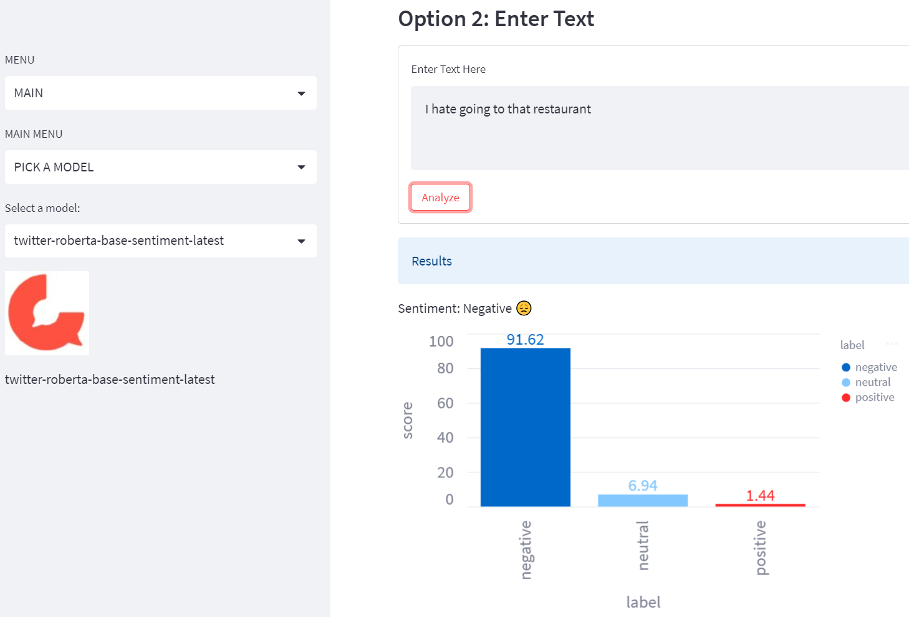

    * **Quick code walk-through**:
        * Objective: Quick demo of the basic test script application. The demo can be run on the console.
            * [GitHub Repository](<URL>)

        | `sentiment_analyzer.py` | `test.py` |
        | --- | --- |
        | 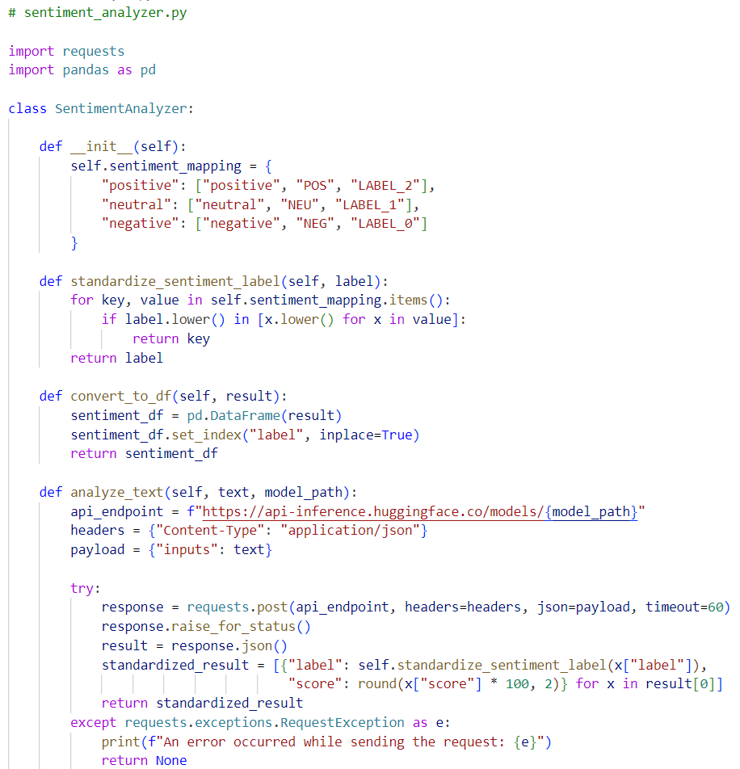 | 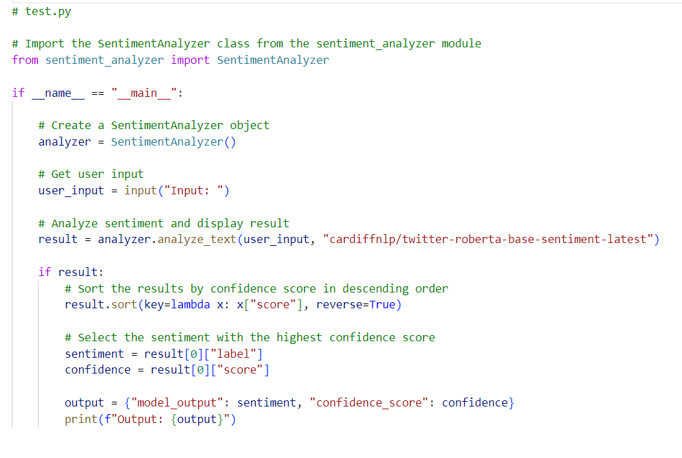 |

    * **Resource Notebook for Benchmarking**:
        * Objective: Benchmark against test dataset and compare computational efficiency.
        * Notes: Since the model sizes are around 1GB, I downloaded the model, ran it locally to compare computational efficiency on my machine, then saved the model output in a csv for all test cases.
        * `Input`: sentiment_test_cases.csv
        * `Output`: 
            * output_{`model_name`}_sentiment_test.csv per model
            * computational_efficiency.csv

            * [GitHub Repository](<URL>)
        * Result `Computational Efficiency` (Running on CPU):

        | Model | Time (seconds) |
        | --- | --- |
        | twitter-roberta-base-sentiment-latest | 27.27 |
        | bertweet-base-sentiment-analysis | 27.52 |
        | twitter-xlm-roberta-base-sentiment | 30.28 |
        | twitter-roberta-base-sentiment | 29.30 |

    * **Cloud Web Application for Testing and Benchmarking**:
    
    * `Use cases` 
    *    
        | `Pick A Model:` | `Model Leaderboard` |
        | --- | --- |
        | 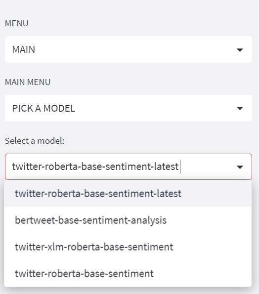 | 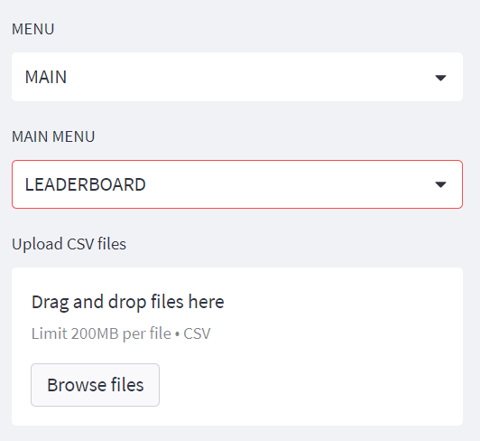

    * `Model Testing`  
    *
        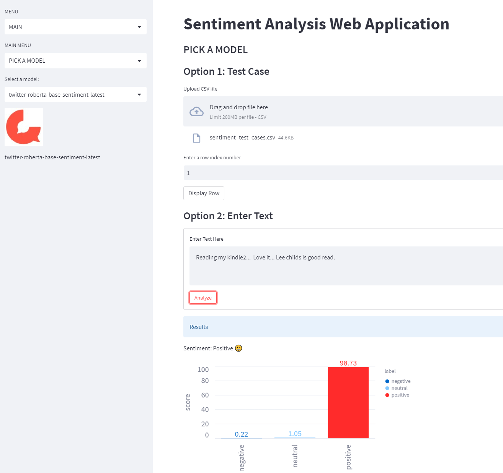

    * `Benchmarking`
    *
        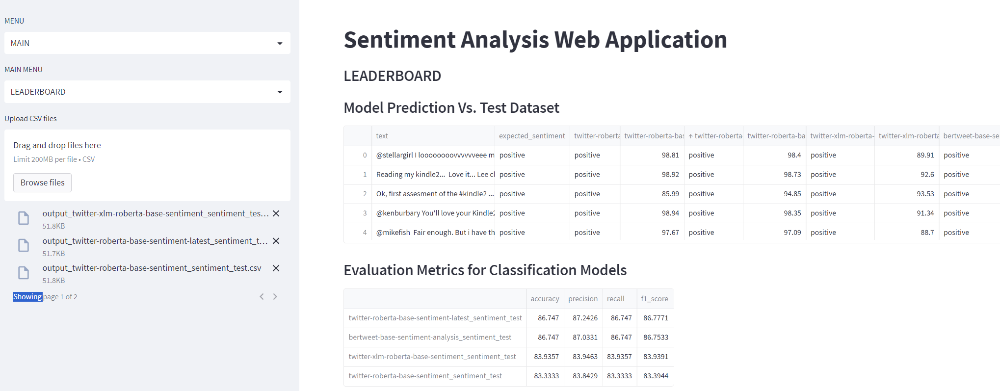

4. **`Results and analysis`**: Leaderboard and evaluation of each model from `sentiment_test_cases.csv dataset` accuracy, weighted average f1_score, etc.

    * **Web application**: Walk through of how to choose a model and do evaluation of the results of model leaderboard against the test_cases. 
        
        * Input:  output_{`model_name`}_sentiment_test.csv `[upload multiple csv files]`
        * Output: summary of model performance metrics in dataframe and visuals

     * **Demo**: Host selected model from Streamlit Cloud Server (no depedency on HuggingFace Inference) from GitHub Repo
         
        * `WEB DASHBOARD` [BENCHMARK]
            * Input: upload `sentiment_test_cases.csv`
            * Output: display output dataframe in requirement for the submission of `output_sentiment_test.csv`
            
            * [Repo](<https://github.com/rcruzin-ai/cardiffnlp-twitter-roberta-base-sentiment-latest.git>)
            * [Web Dashboard](<https://cardiffnlp-twitter-roberta-base-sentiment-latest-rcruzin-ai.streamlit.app/>)
                * `URL: https://cardiffnlp-twitter-roberta-base-sentiment-latest-rcruzin-ai.streamlit.app`

                * `Tested on input text:`
            * 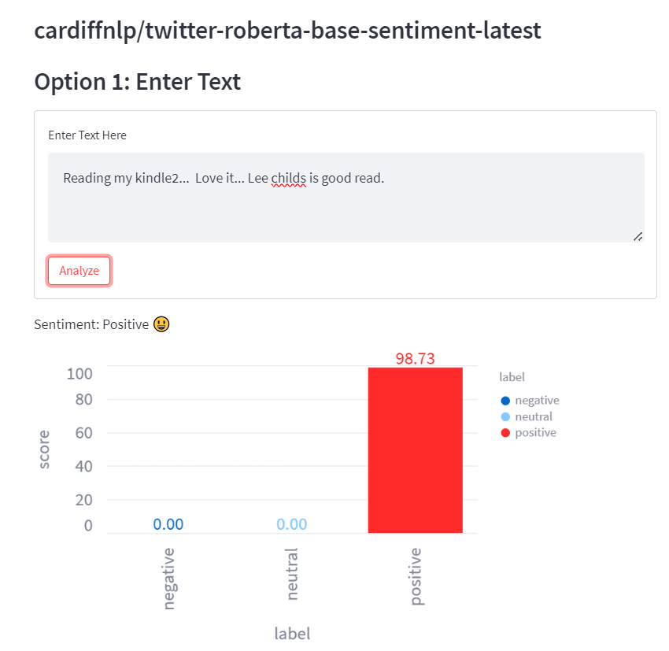
                    
                * `Tested on sentiment_test_cases.csv:`
            * 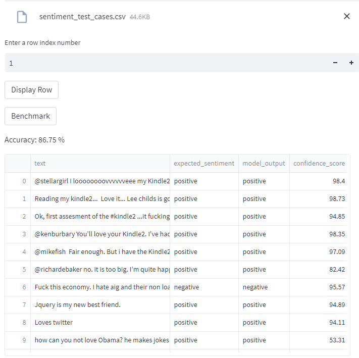

        * `WEB SERVICE`
            * Input: “I hate going to that restaurant”
            * Output: {“model_output”:“negative”,”confidence_score”: 98.42}
                * Github: `https://github.com/rcruzin-ai/cardiffnlp-twitter-roberta-base-sentiment-latest-webservice.git`
                * Demo Web Service: `https://cardiffnlp-twitter-roberta-rcruzin-ai-webservice.streamlit.app/?text=“I hate going to that restaurant”`
                * Tested on browser:
            * 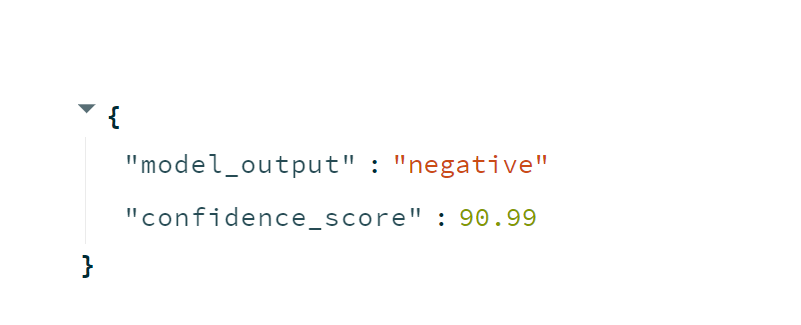
  

    * **Evaluation Metrics (Overall Performance)**
        * 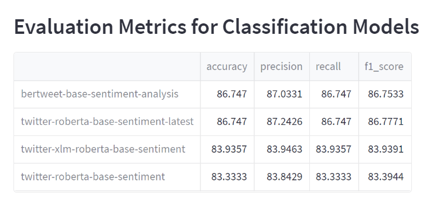
        
    * **Weighted F1 Score Per Class** 
        * 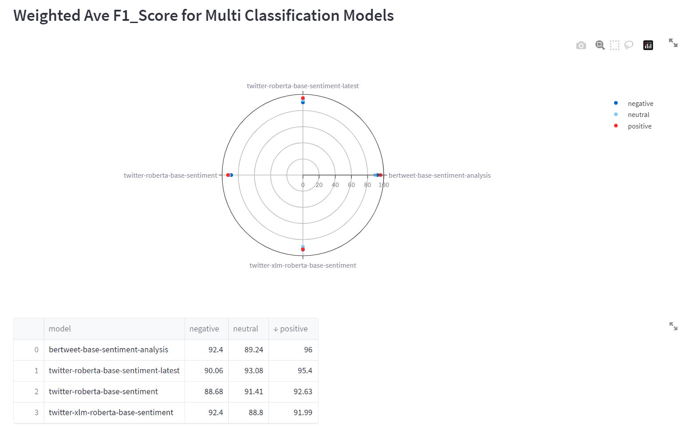

        * [Streamlit Using Huffing Face Inference API](<https://ai-task-rcruzin-ai.streamlit.app/>)
        * `URL: https://ai-task-rcruzin-ai.streamlit.app`
                * [GitHub Repository](<https://github.com/rcruzin-ai/ai-task.git>)

    * **Summary of Results**

        * Winner `**twitter-roberta-base-sentiment-latest**` 😊 from 
            - The best model for the `sentiment_test_cases.csv` dataset. 
            - This model has the highest overall performance in terms of accuracy, precision, recall, and F1 score. 
            - It also has a good balance between computational efficiency and performance, with a relatively fast processing time
            - high F1 scores for all sentiment classes.

5. **`Possible future improvements`**:

    1. We really cannot achieve a near perfect accuracy of sentiment analysis since this problem has subjective and biases to it.   

        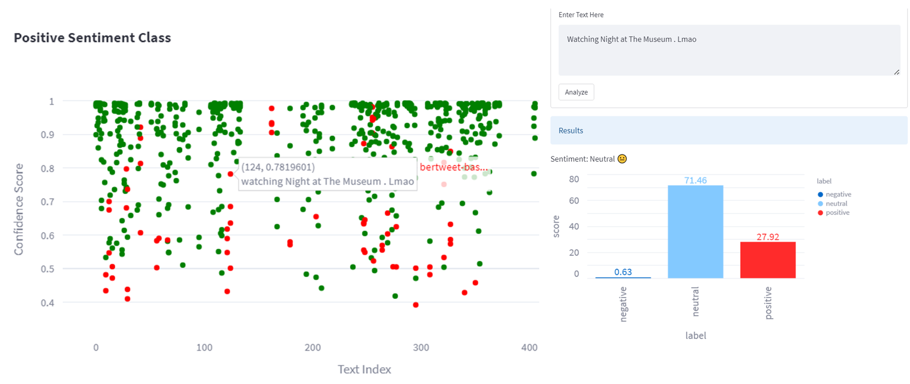
        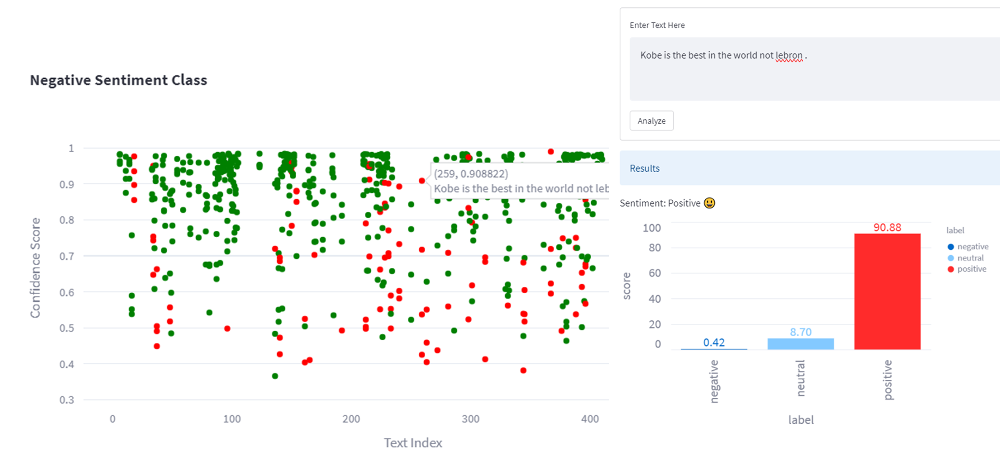
        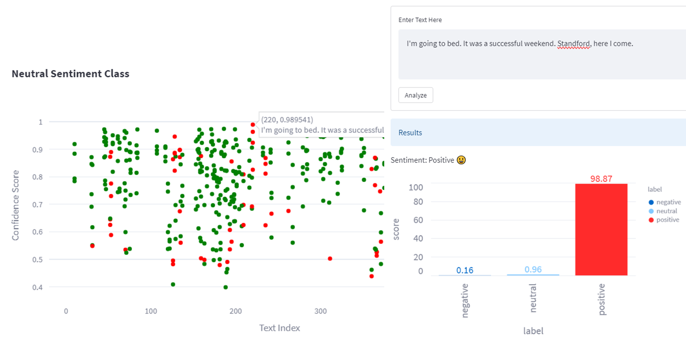
    

    2. Additional insights from the model benchmarking results suggest that `BERT` or `RoBERTa` is a good choice for this problem.
        - The results suggest that the `RoBERTa-base model` is well suited for sentiment analysis tasks, particularly when fine-tuned on a large dataset of English tweets.
        - The `twitter-xlm-roberta-base-sentiment` model supports 8 languages, but since the `test_cases.csv` dataset only contains English tweets, this model may not have performed as well as other models specifically trained on English data.
        - The `bertweet-base-sentiment-analysis` model has a high F1 score for the negative class, indicating that it may be particularly good at identifying negative sentiment in tweets.
        - The `twitter-roberta-base-sentiment-latest` and `bertweet-base-sentiment-analysis` models are both popular, with a large number of downloads last month. This may indicate that they are widely used and well-regarded by the community.
        - Achieving an accuracy of `80%-85%` is a good benchmark. All models were able to deliver this given their base model and the amount of data they were trained and fine-tuned on.
        -

    3. Even though higher accuracy is desirable, this last suggestion might achieved higher accuracy but will be more biased towards the Sentiment140 dataset. Thus, benchmarking base transformer models is always the first step before training your own.

        - To achieve higher accuracy on a specific dataset, we can fine-tune the model (using base models such as RoBERTa or BERTweet) on the Sentiment140 dataset for 3-class labels.

        - Adopting semantic similarity vectors to handle emoji or emoticons in relation to the entire context.
        - 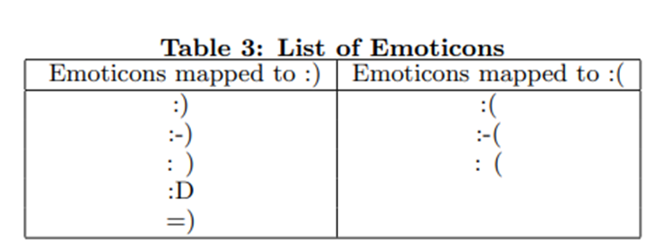
        
        - Reinforcement learning - Fine-tuning on Sentiment140 dataset (~1.6M tweets)
            * Sample Notebook: `https://www.kaggle.com/code/nguyncaoduy/twitter-sentiment-analysis-roberta-96-accuracy/notebook`

6. **Additional(optional) demo to showcase personal projects:**

    * `Chat AI application` [semantic similarity , open ai or open source embeddings and llm, vector databases, langchain framework, streamlit, etc.]

        * [Chat With Your Document: ](<https://st-app1-rcruzin-ai.streamlit.app/>)

        * Lets have a chat, use openai service to check if `Raymond_Cruzin.pdf` can do the `Ai_Technical_Task.pf` given

        * [`Process Documents:`]
        
        * 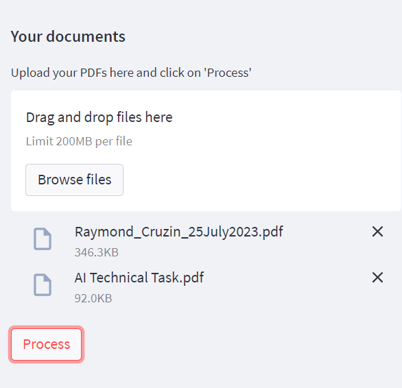
        
        * [`Ask Questions:`]

        * 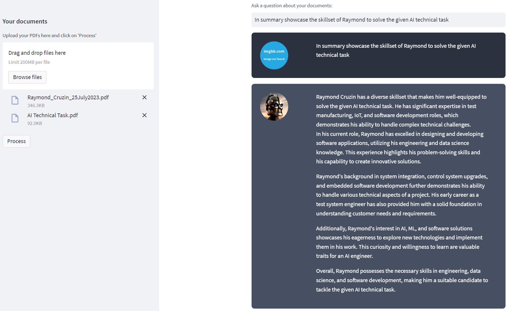

    * A fine-tuned model (on Sentiment140 dataset) using `roBERTa` model.